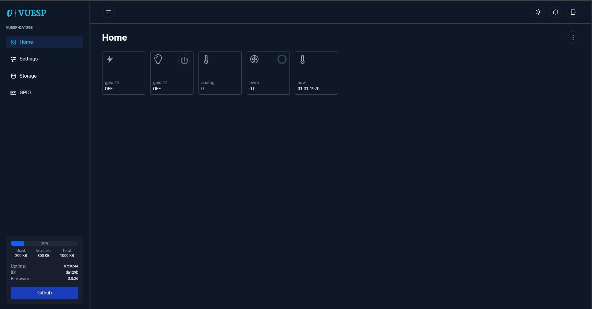

# Vuesp

Vue + ESP = Vuesp

Template for your arduino projects with a web interface.

[ESPAsyncWebServer](https://github.com/me-no-dev/ESPAsyncWebServer) - Async HTTP and WebSocket Server for ESP Arduino  
[Vue3](https://vuejs.org/) - The Progressive JavaScript Framework



## Features

- 🚀 Full-stack Arduino projects with web UI
- 🎨 Modern Vue 3 + TypeScript frontend
- 🔒 Optional HTTP Basic Authentication
- ⚡ Binary WebSocket for efficient communication
- 💾 LittleFS file system support
- 📱 Responsive design with Tailwind CSS
- 🔌 Support for multiple ESP platforms (ESP32, ESP8266)
- 🛠️ Development server with hot reload
- 🏗️ Automated GitHub Actions CI/CD

## Supported Platforms

- ESP32
- ESP32-C3-DevKitM-1
- ESP8266

## Quick Start

### For Users

1. **Clone the repository**

   ```bash
   git clone https://github.com/bondrogeen/vuesp.git
   cd vuesp
   ```

2. **Setup frontend dependencies**

   ```bash
   cd vue
   npm install
   cp .env.example .env
   # Edit .env to set VITE_PROXY to your device IP
   ```

3. **Start development**

   ```bash
   npm run dev
   ```

4. **Build and flash firmware**
   ```bash
   npm run build
   ```

### For Developers

See [DEVELOPMENT.md](./DEVELOPMENT.md) for complete setup and development workflow.

## Documentation

- **[DEVELOPMENT.md](./DEVELOPMENT.md)** - Complete development guide
- **[CONTRIBUTING.md](./CONTRIBUTING.md)** - Contribution guidelines
- **[SECURITY.md](./SECURITY.md)** - Security policies and best practices

## Project Structure

```
vuesp/
├── src/              # C++ firmware source
│   ├── const/        # Constants and struct definitions
│   ├── include/      # Header files
│   └── *.cpp         # Implementation files
├── vue/              # Vue 3 web frontend
│   ├── src/          # Vue components and pages
│   └── public/       # Static assets
├── data/             # LittleFS data
│   └── www/          # Built web UI
├── firmware/         # Compiled firmware binaries
├── scripts/          # Build and utility scripts
├── platformio.ini    # PlatformIO configuration
└── vite.config.ts    # Vite build configuration
```

## Development

```bash
cd vuesp/vue
npm install
```

Next in [.env](./vue/.env.example) file change proxy to your ip device

```bash
VITE_PROXY=192.168.1.100  # Change to your ESP device IP
```

```bash
npm run dev
```

Open http://localhost:5173/ in your browser.

### Available npm Scripts

- `npm run dev` - Start development server
- `npm run build-web` - Build web UI
- `npm run typecheck` - Type check TypeScript
- `npm run lint` - Run ESLint
- `npm run format` - Format code with Prettier
- `npm run check` - Run all code quality checks
- `npm run firmware` - Build and flash firmware
- `npm run build` - Full build (web + firmware)

See [DEVELOPMENT.md](./DEVELOPMENT.md) for more details.

## Building for Production

```bash
npm run build
```

This will:

1. Generate struct/json files from C headers
2. Build and optimize Vue web UI
3. Compile and upload firmware to device

## Security

This project has several security features:

- ✅ Optional HTTP Basic Authentication
- ✅ Binary WebSocket protocol
- ✅ Buffer overflow protection

For production deployment, please read [SECURITY.md](./SECURITY.md) for:

- Best practices
- Known limitations
- Recommended improvements

## Architecture

### Frontend (Vue 3)

- **Type-safe** with TypeScript 5.7
- **Reactive state** with Pinia
- **Routing** with Vue Router
- **UI components** from vuesp-components
- **Styling** with Tailwind CSS

### Backend (C++)

- **HTTP Server** - ESPAsyncWebServer
- **WebSocket** - Binary protocol for efficiency
- **File System** - LittleFS support
- **Tasks** - FreeRTOS task scheduling
- **Configuration** - EEPROM storage

### Communication Protocol

Binary WebSocket messages at `/esp` endpoint:

- First byte: Command ID (1-255)
- Remaining bytes: Struct data
- All platform-specific

## Version History

### 3.2.0 (2025-07-03)

- Minor improvements to documentation
- Add comprehensive development guide
- Add CI/CD GitHub Actions workflow
- Improve frontend error handling

### 3.1.0 (2025-07-03)

- Minor changes

### 3.0.0 (2025-04-03)

- Migrate from Vue CLI to Vite
- Update dependencies to latest versions

### 2.0.0 (2023-06-05)

- Add Tailwind CSS

### 1.3.0 (2023-06-05)

- Add example project

### 1.2.1 (2023-06-04)

- Minor bug fixes

## Contributing

Contributions are welcome! Please read [CONTRIBUTING.md](./CONTRIBUTING.md) for details on our code of conduct and the process for submitting pull requests.

### Before Contributing

1. Read the [Security Policy](./SECURITY.md)
2. Check [existing issues](https://github.com/bondrogeen/vuesp/issues)
3. Follow the [Development Guide](./DEVELOPMENT.md)

## License

This project is licensed under the MIT License - see LICENSE file for details.

## Support

- 📖 Read documentation in [DEVELOPMENT.md](./DEVELOPMENT.md)
- 🐛 Report bugs via [GitHub Issues](https://github.com/bondrogeen/vuesp/issues)
- 💬 Ask questions via [GitHub Discussions](https://github.com/bondrogeen/vuesp/discussions)

## Acknowledgments

- [ESPAsyncWebServer](https://github.com/me-no-dev/ESPAsyncWebServer) - Async HTTP/WebSocket
- [Vue 3](https://vuejs.org/) - Progressive framework
- [PlatformIO](https://platformio.org/) - Embedded development platform
- [Tailwind CSS](https://tailwindcss.com/) - Utility-first CSS

## Related Projects

- [vuesp-components](https://github.com/bondrogeen/vuesp-components) - Vue component library
- [vuesp-struct](https://github.com/bondrogeen/vuesp-struct) - Struct parser and encoder

### 1.2.0 (2023-05-28)

- (bondrogeen) Add GPIO

### 1.1.0 (2022-11-7)

- (bondrogeen) Changed lib struct
- (bondrogeen) Add structure initialization events

### 1.0.0 (2022-10-23)

- (bondrogeen) Changed project structure
- (bondrogeen) Changed web interface
- (bondrogeen) Added build scripts

### 0.1.0 (2022-10-16)

- (bondrogeen) Migrate from Vue2 to Vue3
- (bondrogeen) Changed project structure
- (bondrogeen) Adding a dark theme

### 0.0.3 (2022-01-30)

- (bondrogeen) add read FS

### 0.0.2 (2022-01-15)

- (bondrogeen) update firmware

### 0.0.1 (2022-01-07)

- (bondrogeen) init

## License

The MIT License (MIT)

Copyright (c) 2021-2025, bondrogeen <bondrogeen@gmail.com>

Permission is hereby granted, free of charge, to any person obtaining a copy
of this software and associated documentation files (the "Software"), to deal
in the Software without restriction, including without limitation the rights
to use, copy, modify, merge, publish, distribute, sublicense, and/or sell
copies of the Software, and to permit persons to whom the Software is
furnished to do so, subject to the following conditions:

The above copyright notice and this permission notice shall be included in
all copies or substantial portions of the Software.

THE SOFTWARE IS PROVIDED "AS IS", WITHOUT WARRANTY OF ANY KIND, EXPRESS OR
IMPLIED, INCLUDING BUT NOT LIMITED TO THE WARRANTIES OF MERCHANTABILITY,
FITNESS FOR A PARTICULAR PURPOSE AND NONINFRINGEMENT. IN NO EVENT SHALL THE
AUTHORS OR COPYRIGHT HOLDERS BE LIABLE FOR ANY CLAIM, DAMAGES OR OTHER
LIABILITY, WHETHER IN AN ACTION OF CONTRACT, TORT OR OTHERWISE, ARISING FROM,
OUT OF OR IN CONNECTION WITH THE SOFTWARE OR THE USE OR OTHER DEALINGS IN
THE SOFTWARE.
